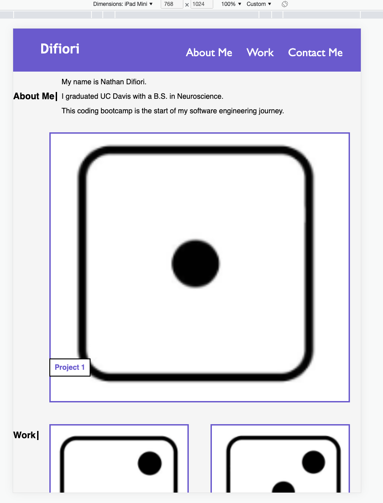
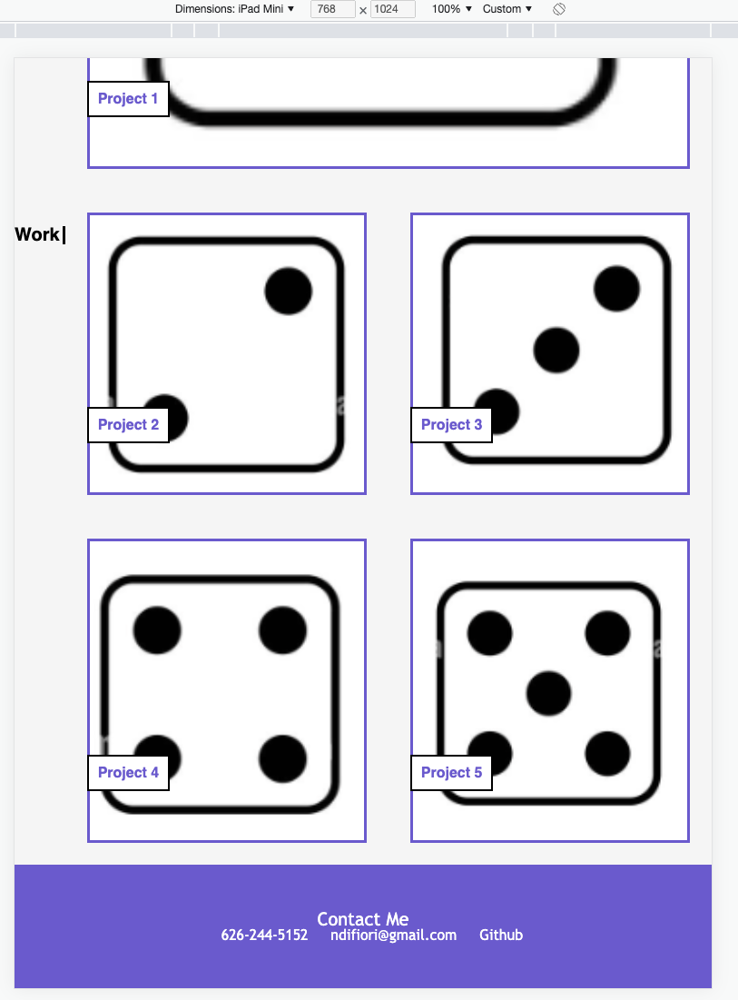

# Portfolio-Page

## The Task

I designed a portfolio landing page.

The webpage is structured to have a header with a navigation menu. The navigation menu contains anchor tags with links to other sections of the page.

The main section of the webpage contains an "About Me" section and a "Work" section.
  The "About Me" section contains a quick snippet describing myself.
  The "Work" section contains image links to my GitHub repositories for the 1st 2 projects with placeholders for projects 3-5.

The last section is a footer with my contact information.

## Quick Sneak PeaK

